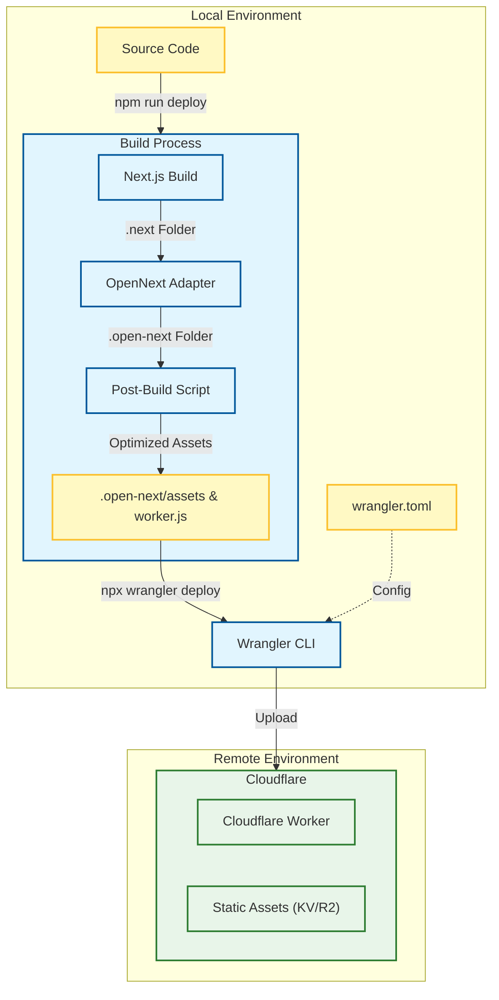

# Project Deployment Guide: Next.js to Cloudflare

This document provides a detailed guide on how to run the project locally, deploy it to Cloudflare, and understand the underlying architecture.

## 1. Local Development Commands

To start the project locally for development, use the following command:

```bash
npm run dev
```

**Note:**
- This command runs `next dev --webpack`.
- It starts the Next.js development server, usually accessible at `http://localhost:3000`.
- It supports hot reloading, so changes in the code are immediately reflected in the browser.

## 2. Remote Deployment Commands

To deploy the project to Cloudflare, use the following command:

```bash
npm run deploy
```

**Note:**
- This is a composite command that executes two steps:
    1.  `npm run build:cloudflare`: Builds the project for the Cloudflare environment.
    2.  `npx wrangler deploy`: Uploads the built assets and worker code to Cloudflare.

If you only need to **build** the project without deploying, run:

```bash
npm run build:cloudflare
```

## 3. Deployment Principles & Architecture

This project uses **OpenNext** to adapt the Next.js application for the **Cloudflare Workers** runtime.

### Key Components

| Component | Role | Description |
| :--- | :--- | :--- |
| **Next.js** | Framework | The React framework used for building the application logic and UI. |
| **.next** | Build Output | The standard build output directory created by Next.js. |
| **OpenNext** | Adapter | A tool (`@opennextjs/cloudflare`) that transforms the standard Next.js build output into a format compatible with Cloudflare Workers. It ensures features like SSR and API routes work on the edge. |
| **.open-next** | Adapted Output | The directory containing the transformed worker code (`worker.js`) and static assets (`assets`) ready for Cloudflare. |
| **Post-Build Script** | Custom Logic | A script (`scripts/post-build.js`) that runs after the OpenNext build. It copies static HTML files and renames `_not-found.html` to `404.html` to ensure Cloudflare handles 404s correctly. |
| **Wrangler** | CLI Tool | Cloudflare's command-line tool. It reads `wrangler.toml` to understand how to configure and upload the worker and assets. |
| **Cloudflare** | Platform | The global edge network where the application runs. |

### Deployment Flow

The following diagram illustrates the process needed to take your source code and deploy it to the Cloudflare network.



### Detailed Steps

1.  **Standard Build**: `next build` compiles the React/Next.js code into the `.next` directory.
2.  **Adaptation**: `@opennextjs/cloudflare` reads the `.next` output and wraps it into a single `worker.js` that implements the Cloudflare Workers API.
3.  **Asset Handling**:
    -   Static assets (images, CSS, JS) are prepared in `.open-next/assets`.
    -   The `post-build.js` script ensures that static HTML exports (like 404 pages) are correctly placed where Cloudflare expects them.
4.  **Upload**: `wrangler deploy` pushes the `worker.js` and the contents of `.open-next/assets` to your Cloudflare account, making the site live globally.
